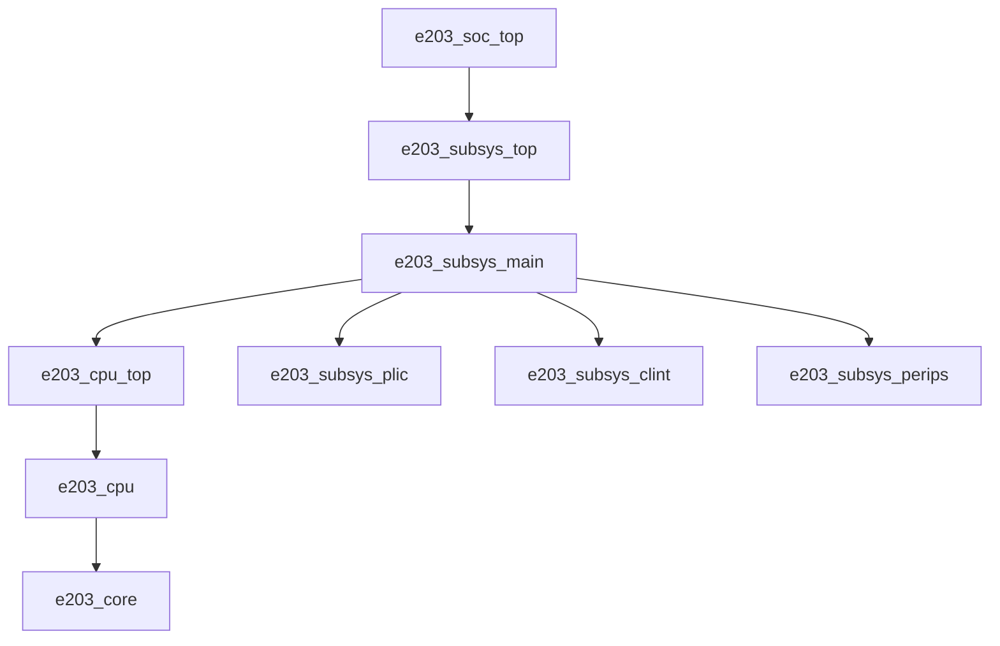

# Hummingbirdv2 E203 SoC 架构说明（中文）

本文基于仓库当前 RTL 与文档内容整理，目标是帮助你快速建立 **“从顶层到模块、从软件到硬件”** 的完整心智模型。

---

## 1. 项目定位与总体结构

E203（Hummingbirdv2）是一个面向嵌入式场景的 RV32 SoC，核心特点：

- RV32IMAC / RV32EMAC（可配置）
- 2 级流水核心（IFU + EXU，LSU 负责访存）
- 机器模式（M-Mode）
- 支持 JTAG 调试
- 支持 NICE（Nuclei 指令协处理扩展）
- SoC 集成了 CLINT/PLIC、GPIO、UART、SPI、I2C、PWM、AON 等外设

代码分层上，主要分为：

- `rtl/e203/core`：CPU 核与紧耦合存储逻辑
- `rtl/e203/subsys`：子系统集成（CPU + 中断控制 + 外设总线连接）
- `rtl/e203/perips`：外设 IP（APB/UART/SPI/GPIO/CLINT/PLIC/AON 等）
- `rtl/e203/soc`：芯片顶层（pad/时钟/复位/JTAG 对外）

---

## 2. 层级关系（Top → Core）

从顶层到核心的主链路如下：

### 各层职责

- **`e203_soc_top`**
  - SoC 最顶层，连接外部 PAD（JTAG/GPIO/QSPI/复位/时钟等）。
  - 将 pad 级信号传递给 `e203_subsys_top`。

- **`e203_subsys_top`**
  - 子系统封装层，处理主时钟/低速时钟、调试相关接口、AON 相关输入。
  - 实例化 `e203_subsys_main`。

- **`e203_subsys_main`**
  - 真正的系统集成层：把 `CPU + PLIC + CLINT + Peripherals` 连接起来。
  - 负责中断线路汇聚（PLIC 外部中断、CLINT 软件/定时中断）并送往 CPU。

- **`e203_cpu_top` / `e203_cpu` / `e203_core`**
  - `cpu_top`：CPU 上层封装，地址窗口与接口使能。
  - `cpu`：胶合逻辑（复位、时钟、中断同步、TCM/SRAM 接口等）。
  - `core`：微架构主体（IFU/EXU/LSU/BIU/CSR/异常提交/NICE 接口）。

---

## 3. CPU 微架构要点

### 3.1 流水线

E203 主体是 2 级流水：

- Stage 1：IFU（取指）
- Stage 2：Decode + Execute + Writeback（EXU）
- LSU 作为访存单元与 EXU/总线协同

### 3.2 前端分支预测（LiteBPU）

`e203_ifu_litebpu.v` 使用轻量静态策略：

- `JAL`：总是预测跳转
- `JALR`：依据 `rs1` 与依赖状态决定是否等待，部分场景会 `bpu_wait`
- 条件分支 `Bxx`：
  - 后向分支预测 taken
  - 前向分支预测 not-taken

这个策略实现简单、面积低，但在分支密集程序中会影响 CPI。

### 3.3 核心模块分工（高频出现）

- IFU：`e203_ifu.v` / `e203_ifu_ifetch.v`
- EXU：`e203_exu*.v`（译码、执行、提交、异常、CSR）
- LSU：`e203_lsu.v`
- BIU：`e203_biu.v`
- TCM 控制：`e203_itcm_ctrl.v` / `e203_dtcm_ctrl.v`
- 时钟复位：`e203_clk_ctrl.v` / `e203_reset_ctrl.v`

---

## 4. 总线与地址空间（ICB）

E203 采用 ICB（valid/ready 命令-响应）互联风格，核心通过地址窗口路由访问不同目标。

默认地址（`rtl/e203/core/config.v`）：

- ITCM：`0x8000_0000`
- DTCM：`0x9000_0000`
- PPI（私有外设窗口）：`0x1000_0000 ~ 0x1FFF_FFFF`
- CLINT：`0x0200_0000`
- PLIC：`0x0C00_0000`
- FIO：`0xF000_0000 ~ 0xFFFF_FFFF`

默认容量配置：

- ITCM：64KB（`E203_CFG_ITCM_ADDR_WIDTH 16`）
- DTCM：64KB（`E203_CFG_DTCM_ADDR_WIDTH 16`）

---

## 5. 中断与调试路径

### 5.1 中断路径

在 `e203_subsys_main` 中：

- 外设中断源（UART/SPI/I2C/PWM/GPIO/WDT/RTC 等）进入 `e203_subsys_plic`
- PLIC 仲裁后输出 `plic_ext_irq`（机器外部中断）
- `e203_subsys_clint` 产生：
  - `clint_sft_irq`（软件中断）
  - `clint_tmr_irq`（定时中断）
- 三类中断最终输入 CPU：`ext_irq_a/sft_irq_a/tmr_irq_a`

### 5.2 调试路径

- 顶层通过 JTAG PAD 接入。
- CPU 侧暴露调试 CSR/寄存器交互信号（如 `dcsr/dpc/dscratch` 写入控制）。
- 支持进入 debug mode、单步、halt 等调试行为。

---

## 6. 启动与复位向量（pc_rtvec）

`pc_rtvec` 来源于 AON 侧逻辑（`sirv_aon_wrapper.v`），通过 `bootrom_n` 引脚选择：

- 选择 BootROM：`pc_rtvec = 0x0000_1000`
- 否则：`pc_rtvec = 0x2000_0000`（外部 QSPI Flash 基址）

IFU 在 reset 请求时会把 PC 置为 `pc_rtvec`，作为取指起点。

---

## 7. 外设子系统概览

根据 `doc/source/soc_peripherals/ips.rst` 与 RTL 集成情况，常见外设包括：

- 中断控制：CLINT、PLIC
- 时钟/低功耗：LCLKGEN、HCLKGEN、PMU、AON
- GPIO：GPIOA/GPIOB（各 32 位）
- 通讯：UART、(Q)SPI、I2C
- 定时与控制：RTC、WDT、PWM

其中 GPIO 复用能力较强，可映射到 UART/SPI/I2C/PWM 等 IOF 功能。

---

## 8. 配置开关（config.v）你最该关注的宏

- 地址宽度：`E203_CFG_ADDR_SIZE_IS_32`
- TCM 使能与大小：`E203_CFG_HAS_ITCM` / `E203_CFG_HAS_DTCM`
- 调试：`E203_CFG_DEBUG_HAS_JTAG`
- NICE：`E203_CFG_HAS_NICE`
- 乘除法：`E203_CFG_SUPPORT_SHARE_MULDIV`
- 原子扩展：`E203_CFG_SUPPORT_AMO`
- 中断同步：`E203_CFG_IRQ_NEED_SYNC`

这些宏会影响接口存在性、地址译码和实现规模，是做架构改造前必须先确认的“边界条件”。

---

## 9. 仿真与验证视角（你当前目录下的实际入口）

- Testbench：`tb/tb_top.v`
  - 连接 SoC 顶层，统计结束条件、周期数、指令有效周期等
- 仿真框架：`vsim/Makefile`
  - 支持 `iverilog` / `vcs`，可 `compile` / `run_test` / `wave`

建议最小闭环：

1. 用 SDK 生成/编译程序
2. 转换并加载到仿真环境
3. 在 `tb_top.v` 观察测试通过标志与性能计数
4. 用 GTKWave 查看 IFU/EXU/LSU 与中断波形

---

## 10. 阅读与改造建议（面向你后续优化）

如果你要做架构分析/性能优化，建议按这个顺序读代码：

1. `e203_soc_top.v`（外部接口边界）
2. `e203_subsys_main.v`（系统集成与中断/外设耦合点）
3. `e203_cpu_top.v`（地址窗口与接口使能）
4. `e203_cpu.v`（时钟复位与胶合逻辑）
5. `e203_core.v` + `e203_ifu_ifetch.v` + `e203_ifu_litebpu.v`（前端关键路径）
6. `e203_exu*.v` / `e203_lsu.v`（执行与访存瓶颈）

对性能最敏感的常见切入点：

- IFU 前端等待（`bpu_wait`、flush/replay）
- 条件分支误预测率
- LSU 等待周期
- ITCM/DTCM 与外设访问比例

---

## 11. 一句话总结

E203 SoC 的本质是：**一个面向嵌入式的轻量 RV32 核（2 级流水）+ ICB 互联 + TCM + 标准中断/调试体系 + 丰富 APB 外设**；其工程结构清晰、模块边界明确，非常适合做教学、验证和小步微架构优化。
