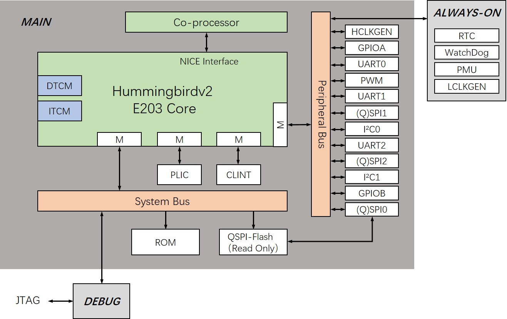
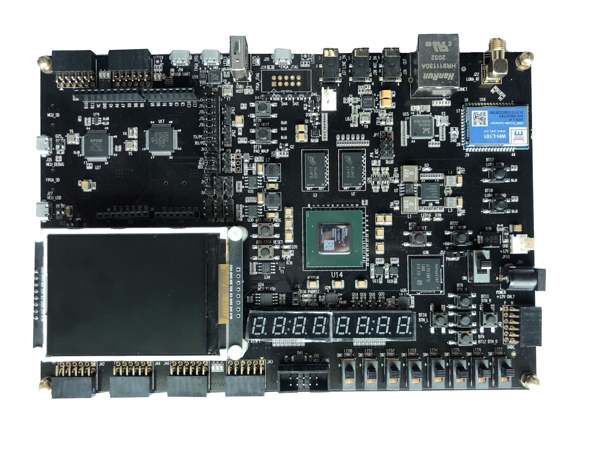
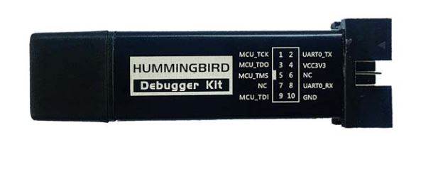

Hummingbirdv2 E203 Core and SoC 
===============================

> [!NOTE]
> **Hummingbird E603** is now available —— a 64-bit RISC-V core you can
freely use for academic and non-commercial projects.  
> Explore it here: [Nuclei-Software/e603_hbird](https://github.com/Nuclei-Software/e603_hbird)

About
-----

This repository hosts the project for open-source Hummingbirdv2 E203 RISC-V processor Core and SoC, it's developped and opensourced by [Nuclei System Technology](www.nucleisys.com), the leading RISC-V IP and Solution company based on China Mainland.

This's an upgraded version of the project Hummingbird E203 maintained in [SI-RISCV/e200_opensource](https://github.com/SI-RISCV/e200_opensource), so we call it Hummingbirdv2 E203, and its architecture is shown in the figure below.

In this new version, we have following updates.
* Add NICE(Nuclei Instruction Co-unit Extension) for E203 core, so user could create customized HW co-units with E203 core easily.
* Integrate the APB interface peripherals(GPIO, I2C, UART, SPI, PWM) from [PULP Platform](https://github.com/pulp-platform) into Hummingbirdv2 SoC, these peripherals are implemented in Verilog language, so it's easy for user to understand. 
* Add new development boards(Nuclei ddr200t and mcu200t) support for Hummingbirdv2 SoC. 

**Welcome to visit https://github.com/riscv-mcu/hbird-sdk/ to use software development kit for the Hummingbird E203.**

**Welcome to visit https://www.rvmcu.com/community.html to participate in the discussion of the Hummingbird E203.**

**Welcome to visit http://www.rvmcu.com/ for more comprehensive information of availiable RISC-V MCU chips and embedded development.**

Detailed Introduction and Quick Start-up
----------------------------------------

We have provided very detailed introduction and quick start-up documents to help you ramping it up. 

The detailed introduction and the quick start documentation can be seen 
from https://doc.nucleisys.com/hbirdv2/.

By following the guidences from the doc, you can very easily start to use Hummingbirdv2 E203 processor Core and SoC.

What are you waiting for? Try it out now!

Dedicated FPGA-Boards and JTAG-Debugger 
---------------------------------------

In order to easy user to study RISC-V in a quick and easy way, we have made dedicated FPGA-Boards and JTAG-Debugger.

#### Nuclei ddr200t development board

#### Nuclei mcu200t development board

#### Hummingbird Debugger

The detailed introduction and the relevant documentation can be seen from https://nucleisys.com/developboard.php.

HummingBird SDK
---------------

Click https://github.com/riscv-mcu/hbird-sdk for software development kit.

WeChat Group
------------

If you would like to join our WeChat group for discussion and support,
please scan the following QR code:

Release History
---------------

#### Notice

* **Many people asked if this core and SoC can be commercially used, the answer as below:**
  - According to the Apache 2.0 license, this open-sourced core can be used in commercial way.
  - But the feature is not full. 
  - The main purpose of this open-sourced core is to be used by students/university/research/
    and entry-level-beginners, hence, the commercial quality (bug-free) and service of this core
    is not not not warranted!!! 

#### Release 0.2.1, Feb 26, 2021

This is `release 0.2.1` of Hummingbirdv2.

+ Hbirdv2 SoC
  - Covert the peripheral IPs implemented in system verilog to verilog implementation.

+ SIM
  - Add new simulation tool(iVerilog) and wave viewer(GTKWave) support for Hummingbirdv2 SoC

#### Release 0.1.2, Nov 20, 2020

This is `release 0.1.2` of Hummingbirdv2.

+ Hbirdv2 SoC
  - Remove unused module
  - Add one more UART

+ FPGA
  - Add new development board(Nuclei mcu200t) support for Hummingbirdv2 SoC
 
#### Release 0.1.1, Jul 28, 2020

This is `release 0.1.1` of Hummingbirdv2.

NOTE:
  + This's an upgraded version of the project Hummingbird E203 maintained in
    [SI-RISCV/e200_opensource](https://github.com/SI-RISCV/e200_opensource).
  + Here are the new features of this release.
    - Add NICE(Nuclei Instruction Co-unit Extension) for E203 core
    - Integrate the APB interface peripherals(GPIO, I2C, UART, SPI, PWM) from PULP Platform
    - Add new development board(Nuclei ddr200t) support for Hummingbirdv2 SoC. 

架构笔记与优化改造路线图
------------------------

本节用于总结 E203 SoC 的架构，便于学习理解；同时给出可落地的 CPU 侧改造方向，在可控风险下提升基线性能。

### 1) SoC 与 CPU 层次结构

硬件层次可概括为：

- `e203_soc_top`：芯片级顶层，连接 PAD/时钟/复位/JTAG
- `e203_subsys_top`：子系统集成层（CPU + 紧耦合基础设施 + 外设/系统接口）
- `e203_cpu_top`：CPU 包装层，包含 SRAM 相关模块
- `e203_cpu`：核心外围胶合逻辑，处理 BIU、中断/调试/时钟/复位交互
- `e203_core`：执行微架构主体（IFU/EXU/LSU + CSR/异常/提交）

E203 核心是紧凑的 2 级流水：

- 第 1 级：IFU（取指）
- 第 2 级：Decode + Execute + Writeback（EXU）
- LSU 负责访存与加载/存储相关交互

### 2) 互联与地址空间（以 ICB 为中心）

E203 使用 ICB（Internal Chip Bus）风格的 valid/ready 命令-响应通道。

CPU/BIU 路由的主要目标包括：

- ITCM（指令 TCM）：默认基地址 `0x8000_0000`
- DTCM（数据 TCM）：默认基地址 `0x9000_0000`
- PPI（私有外设接口）：默认窗口 `0x1000_0000 ~ 0x1FFF_FFFF`
- CLINT：默认基地址 `0x0200_0000`
- PLIC：默认基地址 `0x0C00_0000`
- FIO（快速 IO）：默认窗口 `0xF000_0000 ~ 0xFFFF_FFFF`

以上默认配置来自 `rtl/e203/core/config.v`。

### 3) 当前配置基线（来自 `config.v`）

- RV32 地址宽度（`E203_CFG_ADDR_SIZE_IS_32`）
- ITCM 已使能，默认配置为 64KB（`E203_CFG_ITCM_ADDR_WIDTH 16`）
- DTCM 已使能，默认配置为 64KB（`E203_CFG_DTCM_ADDR_WIDTH 16`）
- JTAG 调试已使能
- IRQ 同步已使能
- NICE 已使能
- 共享多周期乘除法已使能
- AMO 支持已使能

### 4) 前端行为及其性能意义

分支预测模块 `e203_ifu_litebpu.v` 采用了有意简化的静态策略：

- JAL/JALR 在可直接形成目标地址时按 taken 处理
- 条件分支（`Bxx`）使用“后向跳转预测 taken、前向跳转预测 not-taken”的静态策略
- JALR 存在较复杂相关性时可能触发 IFU 停顿（`bpu_wait` 路径）

对短流水线内核而言，前端气泡与分支恢复通常是嵌入式负载（包括 CoreMark 类循环/分支）中 CPI 损失的重要来源。

---

CPU 改造推荐重点
-----------------

优先建议：先优化 **IFU + LiteBPU 前端路径**。

推荐原因：

1. **对基线性能影响直接**：分支与取指气泡会在 2 级流水中快速转化为 CPI 损失。
2. **学习效率高**：可同时触达 IFU/EXU/commit/flush 关键接口，架构学习价值高。
3. **风险可控**：可按小步迭代推进，回退路径清晰，且可配合计数器量化收益。

---

改造/优化清单（架构内标注）
----------------------------

### Phase A（低风险，优先执行）

- [ ] A1. 增加轻量性能计数器用于分析（不改变功能行为）
  - 建议计数项：
    - branch_total
    - branch_mispredict
    - ifu_wait_cycle
    - lsu_wait_cycle
  - 集成位置：CSR/调试可见寄存器，或仿真探针输出
  - 目标：在任何微架构修改前先建立性能基线

- [ ] A2. 增加前端可观测性钩子
  - 增加可选波形/探针信号：
    - 预测 taken / not-taken
    - 预测目标地址
    - 重定向原因（mispredict、exception、debug）
  - 目标：提升波形调试时的问题定位效率

### Phase B（主要性能改造）

- [ ] B1. 将静态 `Bxx` 策略升级为小型动态 BHT（2-bit 饱和计数）
  - 建议规模：32 或 64 项（如用 PC[6:2] 索引）
  - 保持 JAL/JALR 处理与现有流程兼容
  - 在 EXU/commit 分支决议处增加更新逻辑
  - 预期效果：降低循环分支与偏置分支的误预测率

- [ ] B2. 增加最小 BTB 做目标缓存
  - 建议规模：8/16 项，直接映射
  - 存储内容：tag + target（可选 type）
  - 用途：为条件分支/JAL 提供更快重定向
  - 预期效果：降低 taken 分支重定向代价

- [ ] B3. 增加微型 IFU 预取队列（1~2 项）
  - 目的：吸收存储器/握手抖动，减少取指气泡
  - 约束：保持 flush/exception/debug 语义与现有行为一致

### Phase C（可选后续）

- [ ] C1. JALR 相关性路径优化
  - 在保证正确性的前提下，降低常见 jalr 形式触发 `bpu_wait` 的概率
  - 需优先验证数据相关与 flush 边界场景

- [ ] C2. 评估访存侧瓶颈选项
  - 若 profile 显示 LSU wait 占主导，再考虑 BIU 仲裁或内存路径调优
  - 建议放在前端优化后，避免过早引入复杂度

---

验证与学习计划
--------------

每个阶段建议按以下顺序执行：

1. 跑回归/冒烟测试（ISA + hello + coremark 仿真）
2. 对比修改前后计数器
3. 检查关键波形检查点（predict/update/flush/replay）
4. 记录 CPI 与分支误预测率变化

关键结果指标：

- CoreMark/MHz 变化
- branch_mispredict / branch_total
- ifu_wait_cycle / total_cycle

---

建议实施顺序（工程实践）
------------------------

1. A1 -> A2（先做观测与度量）
2. B1（小型 BHT）
3. B2（小型 BTB）
4. B3（先 1 项，再扩 2 项预取）
5. 仅在 profile 显示有价值时再做 C1/C2

这个顺序可以在控制调试成本的同时，最大化每一步改造带来的架构学习收益。
